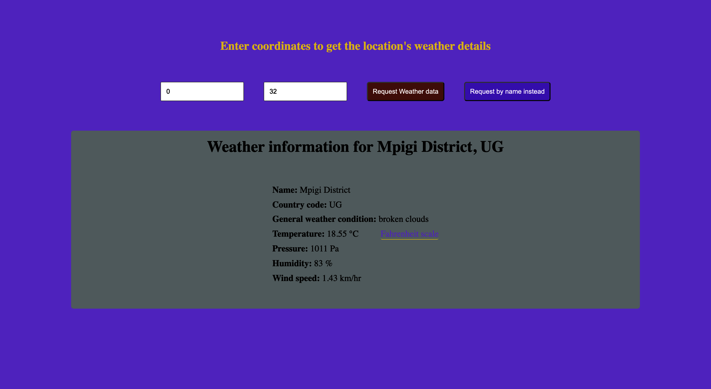

# Weather App

> This is a single page application to request and display a particular place's weather information.

All page information dynamically generated and component loading achieved using pure Javascript. Weather information is requested from the publicly available [OpenWeatherMap](https://openweathermap.org/current) API.

## Built With

- HTML5,
- CSS3,
- Javascript,
- Webpack

## Live Demo

[Live Demo Link](https://raw.githack.com/pbkabali/Weather-App/mvp/dist/index.html)

## Getting Started

To get a local copy up and running in development mode, follow these simple steps.

### Prerequisites

- Node.js
- Browser
- Terminal

### Setup

Clone the project from [here](https://github.com/pbkabali/Weather-App)

### Install

Run `npm install` to get all the dependencies.

Run `npm run build` for one time build of bundle after changes.

Run `npm run watch` to run webpack build in watch mode.

### Usage

Open `./dist/index.html` in your browser

## Author

👤 **Paul Balitema Kabali**

- Github: [@pbkabali](https://github.com/pbkabali)
- Twitter: [@pbkabali](https://twitter.com/pbkabali)
- Linkedin: [engineerbpk](https://linkedin.com/in/engineerbpk)

## 🤝 Contributing

Contributions, issues and feature requests are welcome!

Feel free to check the [issues page](https://github.com/pbkabali/Weather-App/issues).

## Show your support

Give a ⭐️ if you like this project!

## Acknowledgments

- [The Odin Project](https://www.theodinproject.com/)
- [OpenWeatherMap API](https://openweathermap.org/current)
- Microverse Team 140 - The Cupids

## 📝 License

This project is [MIT](https://opensource.org/licenses/MIT) licensed.
